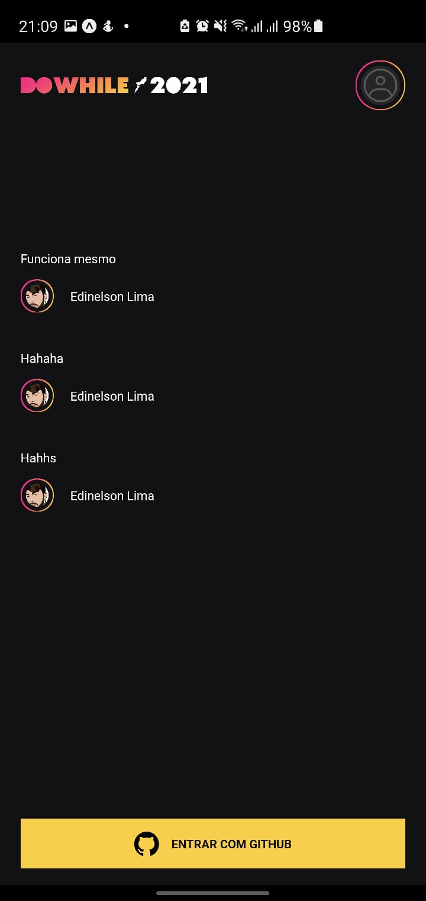

# VERSÃO WEB

   
   
   

### Principais Tecnologias

   
  
   

   
   
   

   

#### Saiba mais sobre cada parte do projeto

-   [Server NodeJS](https://github.com/edinelsonslima/NLW/tree/master/nlw-heat/server)
-   [Web ReactJs](https://github.com/edinelsonslima/NLW/tree/master/nlw-heat/web)
-   [Mobile ReactNative](https://github.com/edinelsonslima/NLW/tree/master/nlw-heat/mobile)
