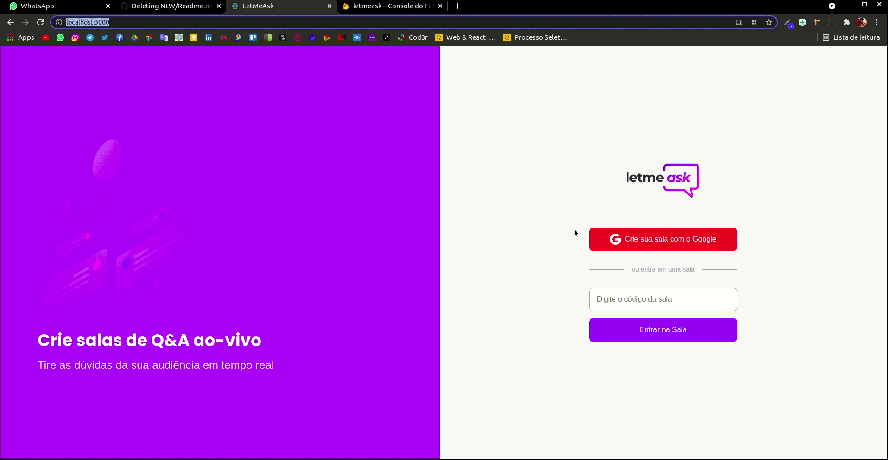

<h1 align="center">LET ME ASK </h1>

 
   

 
 
 

<h2 align="center">Principais tecnologias usadas</h2>

  
  
  
  
  
  
   
  
  

 

## NLW TOGETHER
Aplicação desenvolvida durante a nlw together da rocketseat, tem como objetivo principal gerenciar a quantidade de mensagens que chegam no chat dos streamings por exemplo. Com está aplicação o proprio chat poderá da like nas perguntas que querem que sejam respondidas, assim então facilitando a para o criador de conteudo respoder as perguntas que seu publico mais deseja

 

## Versões das dependências:
 * react: 17.0.2
 * react-dom: 17.0.2
 * react-scripts: 4.0.3
 * classnames: 2.3.1
 * firebase: 8.6.8
 * node-sass: 5.0.0
 * typescript: 4.1.2
 * react-router-dom: 5.2.0
 

 
 
 

## Rode o projeto em sua maquina
- Gerenciador de pacote usado: **Yarn**

Certifique-se de instalar todas as depências do projeto com o comando:  
`yarn`: yarn install  
`npm`: npm i  